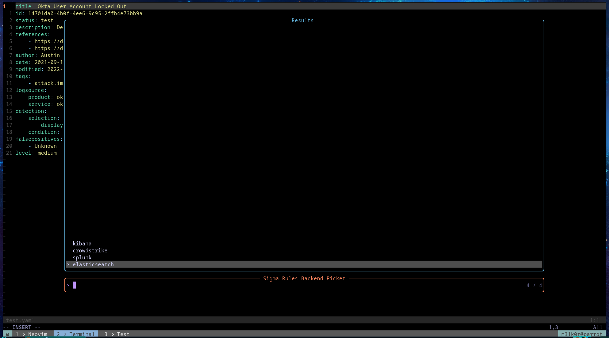
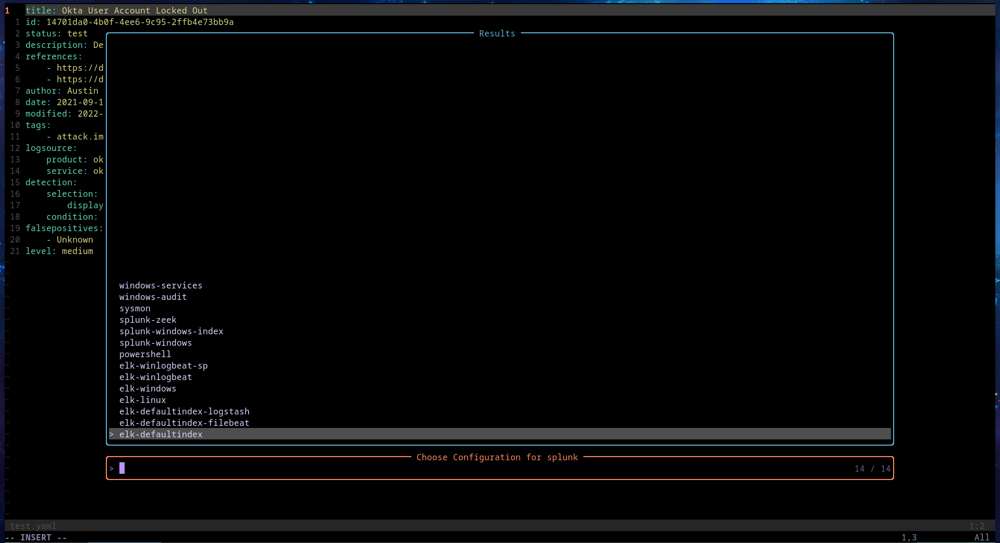
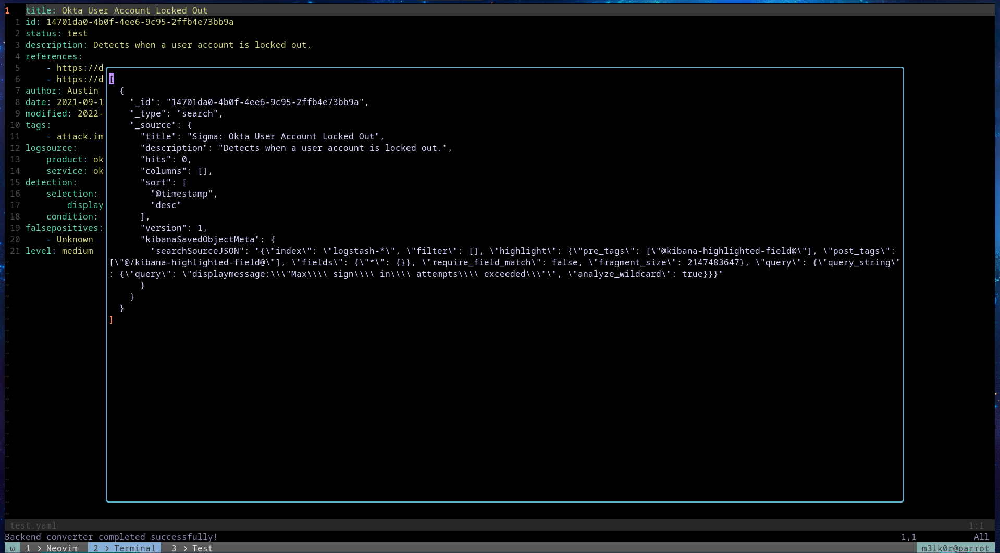
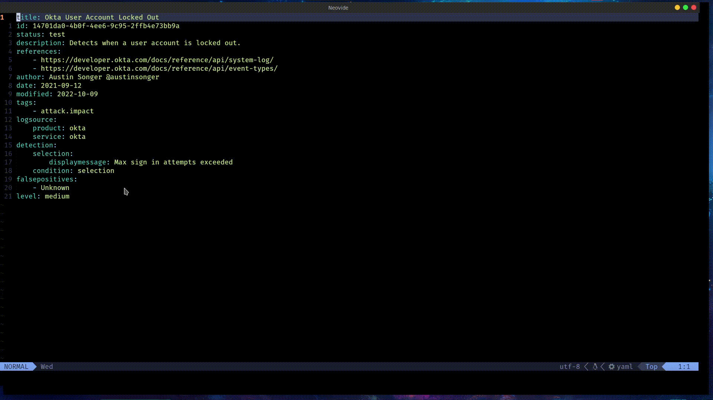

# sigma_picker.nvim


[](https://opensource.org/licenses/apache-2-0)


> This is picker v2. It uses sigma-cli now. If you'd want to access v1 that used sigmac go to picker1 branch

pick and convert to specific backends for sigma rules while inside neovim

I hate 2 things; excessive typing and Real Madrid :joy:

I also write sigma rules a lot. To make my workflow a bit easier for me, I made this plugin to convert to a specific backend with a few keystrokes.
Sigma_picker.nvim helps me to streamline my workflow and do conversions without even thinking. I have been using it for a while and thought maybe
someone else will benefit from it.

## :fire: How it feels
Once you are comfortable with the rule you wrote, call the backend picker and choose



Now choose the preferred config



Your rule should be compiled and you'll get a result like this:



In action


## :star: Requirements
- telescope.nvim
- sigmac installed in your path

## :zap: Installation
Using lazy for example:

```lua
require("lazy").setup({
    {
        "pop-ecx/sigma_picker.nvim",
        dependencies = { "nvim-telescope/telescope.nvim" },
    },
})
```

set your keymap like so 

```lua
local spick = require("sigma_picker")
spick.setup({})
vim.keymap.set('n', '<leader>dz', spick.sigma_picker, {noremap = true , silent = true})
```

> ~~I'm using sigmac. I know it's deprecated. Thanks for reminding me~~. Successfully moved to sigma-cli

> I also wrote a silly little lsp to help me when writing sigma rules. You can get it [here](https://github.com/pop-ecx/sigma-ls.git). Works pretty well with the picker

## Support
Has been tested on neovim 0.9.5.

Should work on neovim >=0.9.5

## TODO
- ~~[ ] Add a few more backends to be converted~~
- [x] Move from sigmac to sigma-cli
- ~~[ ] Setup function is still WIP~~
